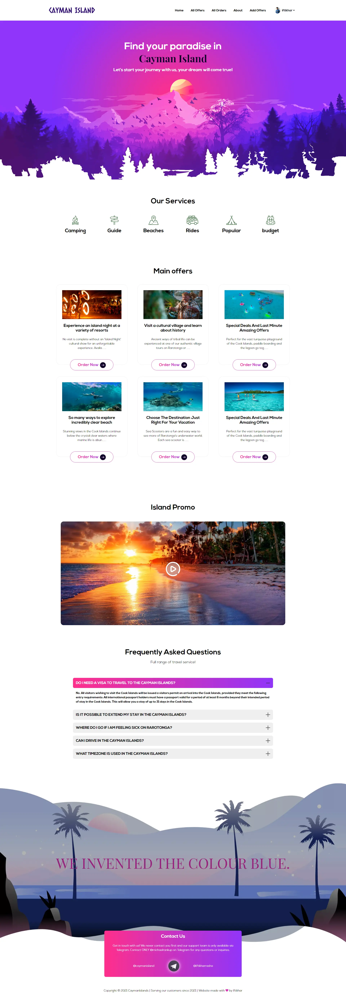

### `Cayman Island - Server Side Code:` [GitHub Repo](https://github.com/iftikharrasha/cayman-island-mern-server-side).

<h1 align="center">
  Cayman Island
</h1>
<p align="center">
  Built using MERN Stack with <a href="https://reactjs.org/" target="_blank">React JS</a> and SASS for front end, <a href="https://expressjs.com/" target="_blank">EXPRESS JS</a> for backend, deployed the server side on <a href="https://www.heroku.com/" target="_blank">Heroku</a> and hosted the on <a href="https://firebase.google.com/" target="_blank">Firebase</a> with firebase authentication.
</p>



## 🚀 Installation

1.  Clone the repository and change directories

    ```shell
    git clone https://github.com/programming-hero-web-course1/tourism-or-delivery-website-client-side-iftikharrasha.git
    cd tourism-or-delivery-website-client-side-iftikharrasha
    ```

2. Install dependencies

    ```shell
    npm install
    ```

3. Start the local server

    The site is now running at `http://localhost:3000`!
    

4.  **Open the source code and start editing!**


## What's inside? 🧐

A quick look at the top-level files hierarchy.

```sh
  .
  ├── .firebase 
  ├── node_modules
  ├── public 
  ├── src
      └── Components
          └── About
            ├── About.js
          └── AddOffer
            ├── AddOffer.js
          └── AllOffers
            ├── AllOffers.js
          └── AllOrders
            ├── AllOrders.js
          └── Faq
            ├── Faq.js
          └── Footer
            ├── Footer.js
          └── Header
            ├── Header.js
          └── Hero
            ├── Hero.js
          └── Login
            ├── Login.js
          └── MyOrders
            ├── MyOrders.js
          └── NotFound
            ├── NotFound.js
          └── OfferDetails
            ├── OfferDetails.js
          └── Offers
            ├── Offers.js
          └── Pagination
            ├── Pagination.js
          └── PlaceOrder
            ├── PlaceOrder.js
          └── PrivateRoute
            ├── PrivateRoute.js
          └── Services
            ├── Services.js
          └── SignUp
            ├── SignUp.js
          └── SingleOffer
            ├── SingleOffer.js
      └── fonts
      └── img
      └── Sass
      ├── App.test.js
      ├── index.js
      ├── logo.svg
      ├── reportWebVitals.js
      ├── ScrollToTop.js
      ├── setupTests.js
  ├── .firebaserc
  ├── .gitignore
  ├── firebase.json
  ├── package-lock.json
  ├── package.json
  ├── README.md
 ```
 
 ## 🎨 Color Reference
| Color          | Hex                                                                |
| -------------- | ------------------------------------------------------------------ |
| Black          |  `#000000` |
| Green        |  `#03C952` |
| Pink        |  `#D831B2` |
| Purple        |  `#9035F9` |
| LiteBlue        |  `#010102` |
| Blue        |  `#130035` |
| DarkBlue        |  `#130035` |
| White          |  `#ffffff` |


